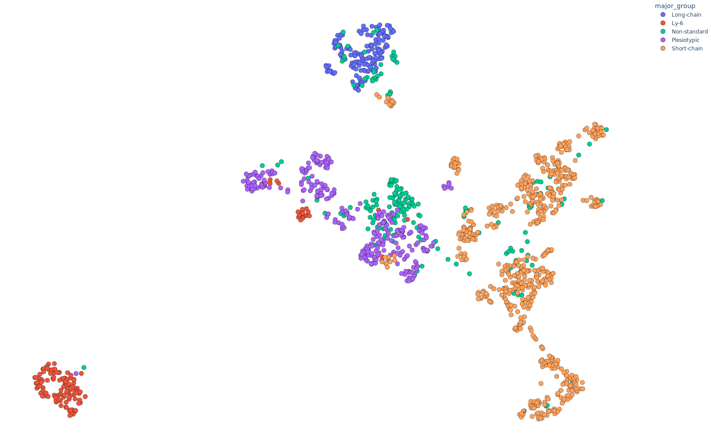

# ProtSpace

ProtSpace is a powerful visualization tool for exploring protein embeddings and structures. It allows users to interactively visualize high-dimensional protein language model data in 2D or 3D space, color-code proteins based on various features, and view protein structures when available.

## Table of Contents

-   [ProtSpace](#protspace)
    -   [Table of Contents](#table-of-contents)
    -   [Quick Start with Google Colab](#quick-start-with-google-colab)
    -   [Example Outputs](#example-outputs)
        -   [2D Scatter Plot (SVG)](#2d-scatter-plot-svg)
        -   [3D Interactive Plot (HTML)](#3d-interactive-plot-html)
    -   [Installation](#Running-Protspace)
    -   [Usage](#usage)
        -   [Preparing Data](#preparing-data)
        -   [Running the ProtSpace App](#running-the-protspace-app)
    -   [Features](#features)
    -   [Data Preparation Script: prepare_json.py](#data-preparation-script-prepare_jsonpy)
        -   [Usage](#usage-1)
        -   [Arguments](#arguments)
        -   [Additional Parameters](#additional-parameters)
        -   [Example](#example)
    -   [Adding Custom Feature Colors](#adding-custom-feature-colors)
        -   [Usage of add_feature_colors.py](#usage-of-add_feature_colorspy)
        -   [Arguments](#arguments-1)
        -   [Feature Colors Input Format](#feature-colors-input-format)
        -   [Example](#example-1)
        -   [Notes](#notes)
    -   [File Formats](#file-formats)
        -   [Input Files](#input-files)
        -   [Output File](#output-file)

## Quick Start with Google Colab

To quickly try out ProtSpace without installing anything on your local machine, you can use our Google Colab notebook. This notebook provides a dummy example that demonstrates the basic functionality of ProtSpace.

[](https://colab.research.google.com/github/tsenoner/ProtSpace/blob/main/examples/notebook/run_dummy_example.ipynb)

Click on the "Open In Colab" button above to open the notebook in Google Colab. You can then run the cells in the notebook to see ProtSpace in action with a sample dataset.

This notebook includes:

-   Installation of required dependencies
-   Generation of a dummy dataset
-   Data preparation using the `prepare_json.py` script
-   Visualization of the data using ProtSpace

It's a great way to get familiar with ProtSpace before setting it up on your local machine or using it with your own data.

## Example Outputs

To give you an idea of what ProtSpace can produce, here are some example outputs:

### 2D Scatter Plot (SVG)

Below is an example of a 2D scatter plot generated by ProtSpace, showing protein embeddings colored by a selected feature:



This SVG image is a static representation of the interactive plot you'll see in the ProtSpace app. In the actual app, you can hover over points to see details, zoom in/out, and pan around the plot.

### 3D Interactive Plot (HTML)

For 3D projections, ProtSpace generates interactive HTML plots. You can view an example of such here:

[View 3D Interactive Plot](https://tsenoner.github.io/ProtSpace/examples/out/3FTx/UMAP3_major_group.html)

## Running Protspace

ProtSpace uses uv for dependency management and packaging. Make sure you have uv installed on your system. If not, you can install it by following the instructions on the [uv website](https://docs.astral.sh/uv/#getting-started).

### Quickly running

```bash
  uvx protspace
```

### Permanent installation

```bash
  uv tool install protspace
  uv tool update-shell
```

If you are looking for the latest stable version on GitHub, please use:

```bash
  uv tool install git+https://github.com/tsenoner/ProtSpace.git
  uv tool update-shell
```

## Usage

### Preparing Data

Before using the ProtSpace app, you need to prepare your data using the `prepare_json.py` script. This script takes protein embedding data and feature information as input and generates a JSON file that the ProtSpace app can read.

To prepare your data:

```bash
uvx --from protspace protspace-json -H path/to/embeddings.h5 -c path/to/features.csv -o output.json --methods pca3 umap2 tsne2
```

For more details on the `prepare_json.py` script, see the [Data Preparation Script](#data-preparation-script-prepare_jsonpy) section below.

### Running the ProtSpace App

To run the ProtSpace app:

```bash
uv tool run protspace <path/to/output.json> [--pdb_dir path/to/pdb/files] [--port 8050]
```

-   `path/to/output.json`: Path to the JSON file generated by the `prepare_json.py` script.
-   `--pdb_dir` (optional): Path to a directory containing PDB files for protein structure visualization.
-   `--port` (optional): Port number to run the server on (default is 8050).

After running the command, open a web browser and navigate to `http://localhost:8050` (or the port you specified) to use the ProtSpace app.

## Features

1. **Interactive Visualization**: Explore protein embeddings in 2D or 3D space using various dimensionality reduction techniques (PCA, UMAP, t-SNE).

2. **Feature-based Coloring**: Color-code proteins based on different features to identify patterns and relationships.

3. **Protein Structure Visualization**: If PDB files are provided, view 3D structures of selected proteins.

4. **Search and Highlight**: Search for specific proteins and highlight them in the visualization.

5. **Downloadable Plots**: Save high-quality images of the visualizations for use in presentations or publications.

6. **Responsive Design**: The app adapts to different screen sizes and layouts.

## Data Preparation Script: prepare_json.py

The `prepare_json.py` script is used to preprocess protein embedding data and feature information into a format that the ProtSpace app can use.

### Usage

```bash
uvx --from protspace protspace-json -H <hdf_file> -c <csv_file> -o <output_json> [options]
```

### Arguments

-   `-H`, `--hdf`: Path to the HDF file containing protein embeddings.
-   `-c`, `--csv`: Path to the CSV file containing protein features.
-   `-o`, `--output`: Path to save the output JSON file.
-   `--methods`: Dimensionality reduction techniques to apply. Options: pca2, pca3, umap2, umap3, tsne2, tsne3. (Default: pca3)
-   `-v`, `--verbose`: Increase output verbosity. Use -v for INFO, -vv for DEBUG.

### Additional Parameters

-   UMAP parameters:

    -   `--n_neighbors`: UMAP n_neighbors parameter (default: 15)
    -   `--min_dist`: UMAP min_dist parameter (default: 0.1)
    -   `--metric`: UMAP metric parameter (default: euclidean)

-   t-SNE parameters:
    -   `--perplexity`: t-SNE perplexity parameter (default: 30)
    -   `--learning_rate`: t-SNE learning_rate parameter (default: 200)

### Example

```bash
uvx --from protspace protspace-json  -H data/3FTx/3FTx_prott5.h5 -c data/3FTx.csv -o data/3FTx.json --methods pca2 pca3 -v
```

This command will process the embeddings from `data/3FTx/3FTx_prott5.h5`, combine them with features from `data/3FTx.csv`, apply PCA (2D) and PCA (3D) dimensionality reduction, and save the result to `data/3FTx.json`. It will also provide verbose output during processing.

## Adding Custom Feature Colors

ProtSpace allows you to customize the colors used for different feature values in your visualizations. You can use the `add_feature_colors.py` script to add or update feature colors in your ProtSpace JSON file.

### Usage of add_feature_colors.py

```bash
uvx --from protspace protspace-feature-colors <input_json_file> <output_json_file> --feature_colors <feature_colors_input>
```

### Arguments

-   `<input_json_file>`: Path to the input JSON file (generated by `prepare_json.py`).
-   `<output_json_file>`: Path to save the updated JSON file.
-   `--feature_colors`: JSON string of feature colors or path to a JSON file containing feature colors.

### Feature Colors Input Format

The feature colors can be provided in two ways:

1. As a JSON string:

    ```
    '{"feature1": {"value1": "#FF0000", "value2": "#00FF00"}}'
    ```

2. As a path to a JSON file containing the feature colors:
    ```
    path/to/colors.json
    ```

The JSON structure should be:

```json
{
    "feature1": {
        "value1": "#FF0000",
        "value2": "#00FF00"
    },
    "feature2": {
        "valueA": "#0000FF",
        "valueB": "#FFFF00"
    }
}
```

### Example

To add custom colors for the "major_group" feature:

```bash
uvx --from protspace protspace-feature-colorsy data/3FTx/3FTx.json data/3FTx/3FTx_colored.json --feature_colors '{"major_group": {"3FTx": "#FF0000", "PLA2": "#00FF00", "SVMP": "#0000FF"}}'
```

This command will update the `data/3FTx/3FTx.json` file with the specified colors for the "major_group" feature and save the result to `data/3FTx/3FTx_colored.json`.

### Notes

-   If a feature or value doesn't exist in the protein data, the script will raise an error.
-   You can update colors for multiple features in a single run.
-   If you're updating an existing color scheme, only the specified colors will be changed or added; existing colors for other values will be preserved.

After adding custom colors, you can use the updated JSON file with the ProtSpace app to visualize your data with the new color scheme.

## File Formats

### Input Files

1. **HDF File (Embeddings)**

    - Format: HDF5
    - Contents: Protein embeddings, where each key is a protein identifier, and the corresponding value is the embedding vector.

2. **CSV File (Features)**

    - Format: CSV
    - Contents: Protein features, with one row per protein and columns for different features. Must include an '**identifier**' column matching the protein IDs in the HDF file.

3. **PDB Files (Optional)**
    - Format: PDB
    - Contents: 3D structure information for proteins. File names should match the protein identifiers (with underscores instead of dots).

### Output File

1. **JSON File**
    - Format: JSON
    - Contents: Processed data including protein features and dimensionality-reduced coordinates for each projection method.

---

We hope you find ProtSpace useful for your protein data visualization needs! For any additional questions or support, please contact us or open an issue on our GitHub repository.
