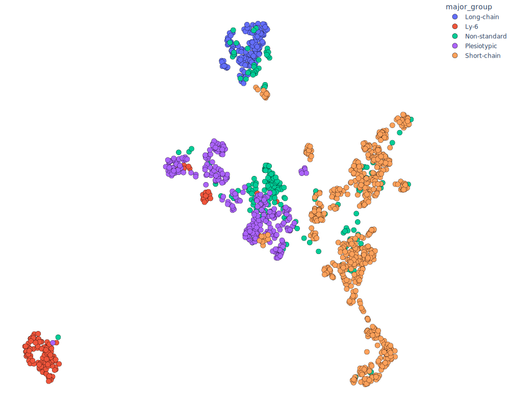

# ProtSpace

ProtSpace is a powerful visualization tool for exploring protein embeddings and structures. It allows users to interactively visualize high-dimensional protein data in 2D or 3D space, color-code proteins based on various features, and view protein structures when available.

## Table of Contents

- [ProtSpace](#protspace)
  - [Table of Contents](#table-of-contents)
  - [Example Outputs](#example-outputs)
    - [2D Scatter Plot (SVG)](#2d-scatter-plot-svg)
    - [3D Interactive Plot (HTML)](#3d-interactive-plot-html)
  - [Installation](#installation)
  - [Usage](#usage)
    - [Preparing Data](#preparing-data)
    - [Running the ProtSpace App](#running-the-protspace-app)
  - [Features](#features)
  - [Data Preparation Script: prepare\_json.py](#data-preparation-script-prepare_jsonpy)
    - [Usage](#usage-1)
    - [Arguments](#arguments)
    - [Additional Parameters](#additional-parameters)
    - [Example](#example)
  - [File Formats](#file-formats)
    - [Input Files](#input-files)
    - [Output File](#output-file)

## Example Outputs

To give you an idea of what ProtSpace can produce, here are some example outputs:

### 2D Scatter Plot (SVG)

Below is an example of a 2D scatter plot generated by ProtSpace, showing protein embeddings colored by a selected feature:



This SVG image is a static representation of the interactive plot you'll see in the ProtSpace app. In the actual app, you can hover over points to see details, zoom in/out, and pan around the plot.

### 3D Interactive Plot (HTML)

For 3D projections, ProtSpace generates interactive HTML plots. You can view an example of such here:

[View 3D Interactive Plot](https://github.io/tsenoner/ProtSpace/3FTx.html)


## Installation

ProtSpace uses Poetry for dependency management and packaging. Make sure you have Poetry installed on your system. If not, you can install it by following the instructions on the [Poetry website](https://python-poetry.org/docs/#installation).

1. Clone the repository:
   ```
   git clone https://github.com/your-username/protspace.git
   cd protspace
   ```

2. Install dependencies using Poetry:
   ```
   poetry install
   ```

   This command will create a virtual environment and install all the required dependencies specified in the `pyproject.toml` file.

3. Activate the virtual environment:
   ```
   poetry shell
   ```

## Usage

### Preparing Data

Before using the ProtSpace app, you need to prepare your data using the `prepare_json.py` script. This script takes protein embedding data and feature information as input and generates a JSON file that the ProtSpace app can read.

To prepare your data:

```
poetry run python prepare_json.py -H path/to/embeddings.h5 -c path/to/features.csv -o output.json --methods pca3 umap2 tsne2
```

For more details on the `prepare_json.py` script, see the [Data Preparation Script](#data-preparation-script-prepare_jsonpy) section below.

### Running the ProtSpace App

To run the ProtSpace app:

```
poetry run python -m app.main path/to/output.json [--pdb_dir path/to/pdb/files] [--port 8050]
```

- `path/to/output.json`: Path to the JSON file generated by the `prepare_json.py` script.
- `--pdb_dir` (optional): Path to a directory containing PDB files for protein structure visualization.
- `--port` (optional): Port number to run the server on (default is 8050).

After running the command, open a web browser and navigate to `http://localhost:8050` (or the port you specified) to use the ProtSpace app.

## Features

1. **Interactive Visualization**: Explore protein embeddings in 2D or 3D space using various dimensionality reduction techniques (PCA, UMAP, t-SNE).

2. **Feature-based Coloring**: Color-code proteins based on different features to identify patterns and relationships.

3. **Protein Structure Visualization**: If PDB files are provided, view 3D structures of selected proteins.

4. **Search and Highlight**: Search for specific proteins and highlight them in the visualization.

5. **Downloadable Plots**: Save high-quality images of the visualizations for use in presentations or publications.

6. **Responsive Design**: The app adapts to different screen sizes and layouts.

## Data Preparation Script: prepare_json.py

The `prepare_json.py` script is used to preprocess protein embedding data and feature information into a format that the ProtSpace app can use.

### Usage

```
poetry run python prepare_json.py -H <hdf_file> -c <csv_file> -o <output_json> [options]
```

### Arguments

- `-H`, `--hdf`: Path to the HDF file containing protein embeddings.
- `-c`, `--csv`: Path to the CSV file containing protein features.
- `-o`, `--output`: Path to save the output JSON file.
- `--methods`: Dimensionality reduction techniques to apply. Options: pca2, pca3, umap2, umap3, tsne2, tsne3. (Default: pca3)
- `-v`, `--verbose`: Increase output verbosity. Use -v for INFO, -vv for DEBUG.

### Additional Parameters

- UMAP parameters:
  - `--n_neighbors`: UMAP n_neighbors parameter (default: 15)
  - `--min_dist`: UMAP min_dist parameter (default: 0.1)
  - `--metric`: UMAP metric parameter (default: euclidean)

- t-SNE parameters:
  - `--perplexity`: t-SNE perplexity parameter (default: 30)
  - `--learning_rate`: t-SNE learning_rate parameter (default: 200)

### Example

```
poetry run python app/data/prepare_json.py -H data/3FTx/3FTx_prott5.h5 -c data/3FTx.csv -o data/3FTx.json --methods pca2 pca3 -v
```

This command will process the embeddings from `data/3FTx/3FTx_prott5.h5`, combine them with features from `data/3FTx.csv`, apply PCA (2D) and PCA (3D) dimensionality reduction, and save the result to `data/3FTx.json`. It will also provide verbose output during processing.

## File Formats

### Input Files

1. **HDF File (Embeddings)**
   - Format: HDF5
   - Contents: Protein embeddings, where each key is a protein identifier, and the corresponding value is the embedding vector.

2. **CSV File (Features)**
   - Format: CSV
   - Contents: Protein features, with one row per protein and columns for different features. Must include an '**identifier**' column matching the protein IDs in the HDF file.

3. **PDB Files (Optional)**
   - Format: PDB
   - Contents: 3D structure information for proteins. File names should match the protein identifiers (with underscores instead of dots).

### Output File

1. **JSON File**
   - Format: JSON
   - Contents: Processed data including protein features and dimensionality-reduced coordinates for each projection method.

---

We hope you find ProtSpace useful for your protein data visualization needs! For any additional questions or support, please contact us or open an issue on our GitHub repository.